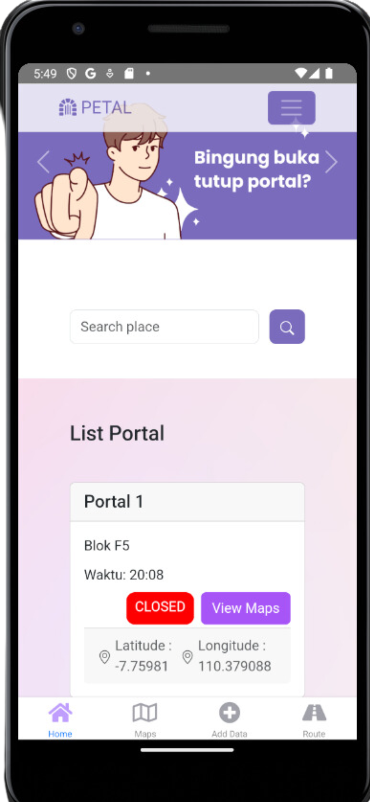

# PETAL (Peta Portal)

## Deskripsi Produk
Peta Portal adalah aplikasi yang dirancang untuk memudahkan pengguna mengetahui jam buka dan tutup portal. Aplikasi ini menyediakan fitur peta interaktif dan routing .

## Komponen Pembangun Produk
Aplikasi ini dibangun menggunakan berbagai komponen teknologi yang mendukung fungsionalitasnya. Berikut adalah beberapa komponen utama:

- **Frontend**: [Framework atau teknologi frontend yang digunakan]
React Native

- **Backend**: [Framework atau teknologi backend yang digunakan]
Apps Script Google Spread Sheet Extension
- **Database**: [Jenis dan sistem manajemen database yang digunakan]
- **Authentication**: [Metode atau layanan autentikasi yang digunakan]

## Sumber Data
Aplikasi ini mengandalkan beberapa sumber data untuk menyajikan informasi kepada pengguna. Sumber data utama meliputi:

- Input data portal

## Tangkapan Layar Komponen Penting Produk
Berikut adalah beberapa tangkapan layar yang menunjukkan komponen penting dalam aplikasi:

1. [Tambahkan tangkapan layar pertama]
   

2. [Tambahkan tangkapan layar kedua]
   

3. [Tambahkan tangkapan layar ketiga]
   

3. [Tambahkan tangkapan layar ketiga]
   

3. [Tambahkan tangkapan layar ketiga]
   
